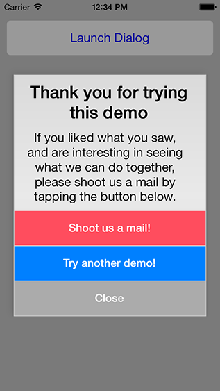

# Custom iOS7 AlertView

`v0.5`

The addSubview is not available in UIAlertView in iOS7 any more. The view hierarchy for this class is private and must not be modified.

As a solution, this class creates an iOS7-style dialog which you can extend with any UIViews or buttons. The animations and the looks are copied too and no images or other resources are needed.



## Install

As simple as adding the following files to your project:

* CustomIOS7AlertView.h
* CustomIOS7AlertView.m

## Change notes

* A new `init` method is added in which you don't have to pass on the parent view any more. It's easy to migrate to this one, so in case it works just use this new init function. If it fails, please add an issue here so that I can track down the bugs.

## Quick start guide

1. Create the UIView object `changed`

    ```
    CustomIOS7AlertView *alertView = [[CustomIOS7AlertView alloc] init];
    ```
  
2. Add some custom content to the alert view (optional)

    ```
    UIView *customView ..;

    [alertView setContainerView:customView];
    ```

3. Display the dialog

    ```
    [alertView show];
    ```

## More functions

* Close the dialog

    ```
    [alertView close];
    ```

* To add more buttons, pass a list of titles

    ```
    [alertView setButtonTitles:[NSMutableArray arrayWithObjects:@"Shoot us a mail!", @"Try another demo!", @"Close", nil]];
    ```

* To add colors buttons, pass a list of colors

    ```
    [alertView setButtonColors:[NSMutableArray arrayWithObjects:[UIColor colorWithRed:255.0f/255.0f green:77.0f/255.0f blue:94.0f/255.0f alpha:1.0f],[UIColor colorWithRed:0.0f green:0.5f blue:1.0f alpha:1.0f]], nil];
    ```

* You can remove all buttons by passing nil

    ```
    [alertView setButtonTitles:NULL];
    ```

* You can enable or disable the iOS7 parallax effects on the alert view

    ```
    [alertView setUseMotionEffects:TRUE];
    ```

* Handle button clicks with a custom delegate

    First, set the delegate:

    ```
    [alertView setDelegate:self];
    ```

    Then add the delegate methods:

    ```
    - (void)customIOS7dialogButtonTouchUpInside: (CustomIOS7AlertView *)alertView clickedButtonAtIndex: (NSInteger)buttonIndex
    {
        NSLog(@"Button at position %d is clicked on alertView %d.", buttonIndex, [alertView tag]);
    }
    ```

* Handle button clicks with a code block

    ```
    [alertView setOnButtonTouchUpInside:^(CustomIOS7AlertView *alertView, int buttonIndex) {
        NSLog(@"Block: Button at position %d is clicked on alertView %d.", buttonIndex, [alertView tag]);
        [alertView close];
    }];
    ```

    You can also disable all other delegates by:

    ```
[alertView setDelegate:self];
    ```

* You can pass a parent view while initialise:

    ```
    CustomIOS7AlertView *alertView = [[CustomIOS7AlertView alloc] initWithParentView:self.view];
    ```

    In this case the alertView will be attached to the parent view - if you don't pass any, we will try to add the view to the top most view in the hierarchy.

## Todos

This is a really quick implementation, and there are a few things missing:

* Even better rotation support (works with landscape and portrait mode too, so the current best practise is to re-open the same dialog once the screen is rotated)

* Adding more buttons: they don't exactly match the look with that of on iOS7

## Special thanks to

* [@wimagguc](https://github.com/wimagguc/ios-custom-alertview) for the initial repository
* [@tamasdancsi](https://github.com/tamasdancsi) for his support with the initial code  
* [@dingosky](https://github.com/dingosky) for his work on the parallax effects code  
* [@raspu](https://github.com/raspu) for his work on the protocol delegates, iOS6 support and onButtonClick blocks  
* [@sbandol](https://github.com/sbandol) for his idea on adding the AlertView as the top most view in the hierarchy

## License

**Please feel free to push back anything you think is useful for the project.**

`License info is here for request. Please suggest a better one if you are familiar with copyright.`

Copyright (c) 2013 Quentin Rousseau

Lincesed under [The MIT License](http://opensource.org/licenses/MIT) (MIT)

Permission is hereby granted, free of charge, to any person obtaining a copy
of this software and associated documentation files (the "Software"), to deal
in the Software without restriction, including without limitation the rights
to use, copy, modify, merge, publish, distribute, sublicense, and/or sell
copies of the Software, and to permit persons to whom the Software is
furnished to do so, subject to the following conditions:

The above copyright notice and this permission notice shall be included in
all copies or substantial portions of the Software.

THE SOFTWARE IS PROVIDED "AS IS", WITHOUT WARRANTY OF ANY KIND, EXPRESS OR
IMPLIED, INCLUDING BUT NOT LIMITED TO THE WARRANTIES OF MERCHANTABILITY,
FITNESS FOR A PARTICULAR PURPOSE AND NONINFRINGEMENT. IN NO EVENT SHALL THE
AUTHORS OR COPYRIGHT HOLDERS BE LIABLE FOR ANY CLAIM, DAMAGES OR OTHER
LIABILITY, WHETHER IN AN ACTION OF CONTRACT, TORT OR OTHERWISE, ARISING FROM,
OUT OF OR IN CONNECTION WITH THE SOFTWARE OR THE USE OR OTHER DEALINGS IN
THE SOFTWARE.

## Other projects

Some more of my free stuff for web devs at [Github](https://github.com/kwent?tab=repositories).

## About

Quentin Rousseau  
[www.quentinrousseau.fr](http://www.quentinrousseau.fr/)  

twitter: [@quentinrousseau](http://twitter.com/quentinrousseau)  
linkedin: [linkedin.com/in/quentinrousseau](https://www.linkedin.com/in/quentinrousseau)

